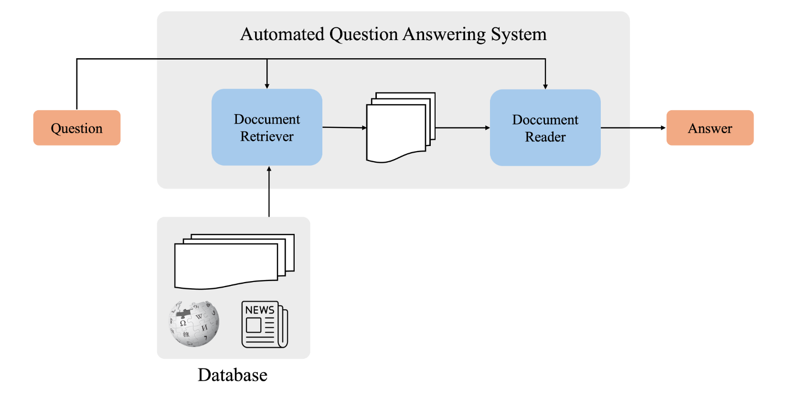
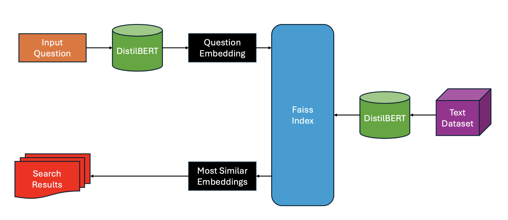

# E2E-QA

In this project, we will build a end-to-end question answering system based on the SQuAD2.0 dataset—a reading comprehension dataset—using a vector database called FAISS and the BERT model to answer question based on answer in the documents provided. To build an end-to-end Question Answering program, we need to complete two main modules: the Retriever and the Reader.

- Retriever: The component that queries documents relevant to the question in the database.
- Reader: Based on the queried documents and the input question, it extracts the text span containing the most accurate answer and sends it to the user.

## Notebooks

- HF_Faiss_Search: notebook about building a FAISS index on SQuAD2.0 dataset
- DistilBERT_QA: notebook about finetuning DistillBERT on SQuAD2.0 dataset
- E2E-QA: pipeline of an E2E-QA system

## Overall pipeline

## Faiss pipeline

